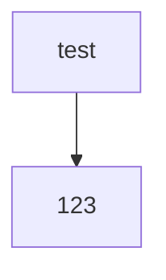

# pods-tdd
This is an IntelliJ project which can be used to practice TDD skills.
If you haven't attended/watched the PODS TDD session, it's recommended you start there first.

## How to use this repo

If you want to run code for output, navigate to /src/main/main.scala.
It's interactive, so you can run this with the UI in IntelliJ.

If you want to run a Spec/Suite, navigate to your chosen Spec in /test/scala/XSpec.
Again, interactive, so you can run with the UI in IntelliJ.

