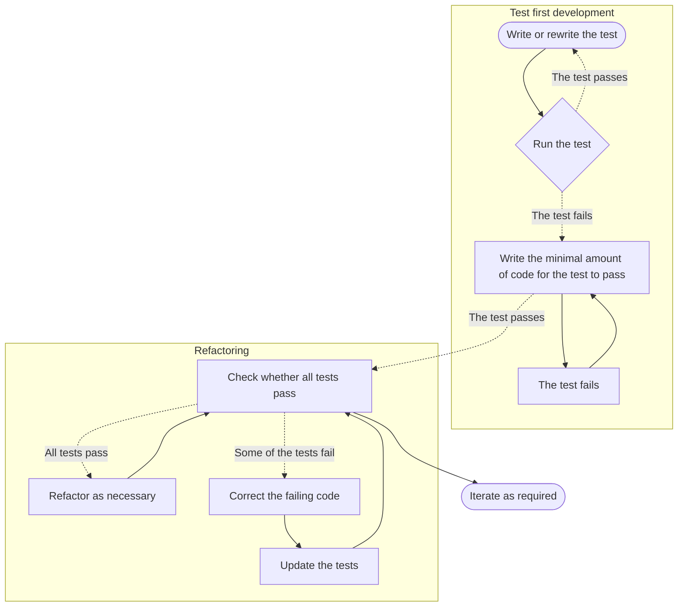

# pods-tdd
This is an IntelliJ project which can be used to practice test-driven development (TDD) skills.
If you haven't attended/watched the PODS TDD session, it's recommended you start there first.

## How to use this repo

If you want to run code for output, navigate to /src/main/main.scala.
It's interactive, so you can run this with the UI in IntelliJ or with `sbt run`.

If you want to run a Spec/Suite, navigate to your chosen Spec in /test/scala/XSpec.
Again, interactive, so you can run with the UI in IntelliJ or with `sbt test`.

The test library is MUnit - those who've worked with JUnit will be familiar.
The concepts apply to any library you'll use when working in TDD.

## What is test-driven development?

> Test-driven development (TDD) is an evolutionary approach to software development. It combines test first development, where you write a test _before_ you write the minimal production code required to satisfy that test, and a refactoring cycle.

In TDD, you convert the requirements of your ticket into test cases before your code is fully functional.
You then track your progress by continuously measuring your software against your test cases.

Okay, great, but what are the actual steps to writing software in TDD?

### The TDD lifecycle:
1. Write a test.
    - When you want to add a new feature, you must first write a new test.
    - This test will pass _if and only if (IFF)_ the specification of the feature is met (info available on the ticket).
2. Run all of the tests. The new one _should_ fail.
    - This is a sanity check: your old things should still work and your new thing shouldn't...
    - ... because you haven't written the code for it yet.
3. Write the minimum amount of code that will make the test pass.
    - This can be as inelegant as you like for now, you will refactor later.
    - You shouldn't add code beyond the scope of what you're testing though.
4. Re-run the tests. They should now all pass!
    - If you have unexpected failures, that's a good thing, because you've just found more code to revise.
    - Repeat Step 3 for any failures.
5. Refactor your code as required.
    - Your code works now, but it might not be optimal for any number of reasons like:
      - Legibility: is it hard to read or work with? Do the names of things make sense?
      - Hard-coded values: can these be swapped out for calls to API, etc.?
      - Don't repeat yourself (DRY) principle: can you extract the functionality to a generic method/function etc.?
      - Does your code belong in the place you've put it, or somewhere else?
      - Does your code do too many things at once? Can it be split into smaller methods/functions, etc.?

### The TDD lifecycle diagram:



## Why TDD?

- You end up with code that you know works, because it passes all of your tests.
- Because you code with clear intentions (this code must pass this test), your designs are often clean (after refactoring).
  - It's often more productive, too, because you're working with one thing in mind at a time.
- Your tests will _drive_ the design of your code; not any preconceptions you may have. 
- You have confidence that your code is fully covered by tests because you write a new test for every new feature.
- You know that your new code doesn't break old things because you re-run all tests once you're happy.
- It helps developers who will work with your code in the future understand the code's requirements at a glance.

## How should I actually write a unit test?

You want your unit tests to be 'small':
- They should test that one thing works (or doesn't), e.g., does this method return a `List(x, y)`?
- It should be obvious what the test does by reading it at a glance:
  - e.g. "return OK with valid payload"
  - if it _doesn't_ return OK and the test fails, you'll see this in the console and you can start fixing it.
- They should run quickly:
  - you'll be adding this new test to a suite of tests which will run every time from now on...
  - ... so if it takes 20s to run, you've just added +20s for every time you want to run the suite...
  - ... over time this will be very annoying.
- They shouldn't depend on other things, e.g. a state or another test result:
  - this will lead to hard-to-trace errors and integration testing is its own discipline.

## Yes, but in code? What does a unit test look like?

The actual syntax will depend on the library that you're working with, but the principles are always the same.

Here's the anatomy of the simplest test in this project, called "Give me the same number I put in".
This test is here: `src/test/scala/MainSpec.scala`

```scala
// Importing all the methods from main
import scala.main._

class MainSpec extends munit.FunSuite {         // This is the suite: all tests for main will go in here.
   test("Give me the same number I put in") {   // The name of the test.
      // Given
      val input42: Int = 42
      // When
      val giveMe42 = giveMeN(input42)
      // Then
      assertEquals(giveMe42, input42)
   }
}
```

This is obviously a contrived scenario, but the _Given, When, Then_ pattern is what's important:
- Given: what is the context for our test scenario. Here, the context is that we're passing in 42 as a parameter.
- When: the method we want to test. Here, the method is `giveMeN`, and we're passing it our input.
- Then: what we assert will be the case. Here, we assert that `giveMe42 == 42`.